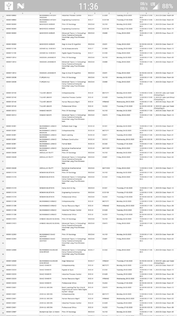
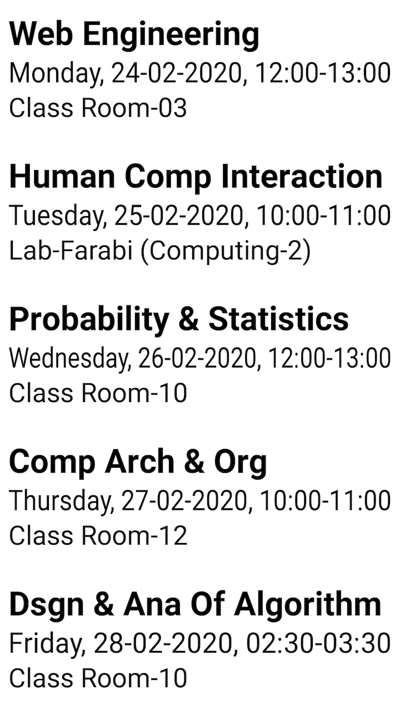

<h2>The Problem</h2>

	My school was emailing all of its students <strong>everyone's</strong> exam seating arrangements in a big Excel file.
	It was quite bothersome for everyone to find a their own information. Most people checked their seating arrangements
	on their phones hurriedly at the last minute just before every exam. The process was:
	<ol>
		<li>Open your email client.</li>
		<li>Find that one email burried somewhere which contains the said Excel file.</li>
		<li>Most people were manually scrolling and searching through this big Excel file for the relevant information
			because they were not aware of the Search functionality of their Excel viewer.</li>
	</ol>
	A small smartphone screen plus a dense Excel sheet is not an enjoyable experience especially when you are already worried
	about your exam.

<h2>The Solution</h2>

	I had a rough idea to circulate a python executable which would fetch the required data for the student from their emails. When I
	discussed the idea with a friend of mine, he suggested that a static website where everyone can search for their arrangements
	will be a better solution and I agreed but I knew almost nothing about making websites at the time. So this friend encouraged
	and helped me a lot as this was one of my first times writing HTML, CSS and JavaScript.

	The end result was a trimmed and formatted, smartphone-friendly, easy-to-access respresentation of the required information
	by entering the university registration number in a simple search box.

	<h4>Before:</h4>
	

	<h4>After:</h4>
	

